# Introduction  

This document records all the ATAC-seq analysis presented in Ponroy Bally et al, 2020 including reading in peak sets from the ATAC-seq experiment and running through the DiffBind routines for assessing global changes and differential analysis. 


# Set up
  
## Load libraries:


```r
library(magrittr)
library(RColorBrewer)
library(DiffBind)

library(ChIPseeker)
library(TxDb.Hsapiens.UCSC.hg19.knownGene)

library(tidyverse)
library(ggrepel)
library(knitr)
library(clusterProfiler)
source("functions.R")
ggplot2::theme_set(theme_pub())
```

## Set up some palettes:


```r
pal_rb <- colorRampPalette(rev(RColorBrewer::brewer.pal(8, "RdBu")))(100)
pal_geno <- c("#EB3BF7", "#93958E")
names(pal_geno) <- c("DS", "CTL")

pal_extremes <- c(rgb(173, 41, 182, maxColorValue = 255), # magenta
                  rgb(86, 194, 57, maxColorValue = 255))  # green

pal_volcano <- c(pal_extremes, "gray80")
names(pal_volcano) <- c("Significantly less accessible",
                        "Significantly more accessible",
                        "Not significant")
```

# DiffBind  
  
## Create a sample sheet for DiffBind:


```r
bams <- list.files("rmdup", pattern = "*.bam$", full.names = TRUE)
peaks <- list.files("peaks", pattern = "*.narrowPeak",
                    full.names = TRUE)
ids <- bams %>% basename %>% str_extract('(?<=\\_)[:alnum:]+')

samples <- data.frame("Cell_Line"  = ids,
                      "Tissue"     = ids,
                      "Replicate"  = rep(c(1, 2), each = 6),
                      "bamReads"   = bams,
                      "Peaks"      = peaks,
                      "PeakCaller" = "bed") %>% 
  mutate(SampleID = paste0(Cell_Line, "_", Replicate),
         Condition = ifelse(Cell_Line %in% c("AG38", "ATCC", "GM04"), "DS", "CTL"))

kable(bams, format = "markdown", caption="Bam Files")
```


|x                                                           |
|:-----------------------------------------------------------|
|rmdup/HI.4713.003.N701---N502.1_GM168_openRegions.rmdup.bam |
|rmdup/HI.4713.003.N702---N502.2_GM191_openRegions.rmdup.bam |
|rmdup/HI.4713.003.N703---N502.3_GM260_openRegions.rmdup.bam |
|rmdup/HI.4713.003.N704---N502.4_ATCC_openRegions.rmdup.bam  |
|rmdup/HI.4713.003.N705---N502.5_GM04_openRegions.rmdup.bam  |
|rmdup/HI.4713.003.N706---N502.6_AG38_openRegions.rmdup.bam  |
|rmdup/HI.4713.004.N701---N502.1_GM168_openRegions.rmdup.bam |
|rmdup/HI.4713.004.N702---N502.2_GM191_openRegions.rmdup.bam |
|rmdup/HI.4713.004.N703---N502.3_GM260_openRegions.rmdup.bam |
|rmdup/HI.4713.004.N704---N502.4_ATCC_openRegions.rmdup.bam  |
|rmdup/HI.4713.004.N705---N502.5_GM04_openRegions.rmdup.bam  |
|rmdup/HI.4713.004.N706---N502.6_AG38_openRegions.rmdup.bam  |

```r
kable(samples, format = "markdown", caption="Sample Metadata")
```


|Cell_Line |Tissue | Replicate|bamReads                                                    |Peaks                                                              |PeakCaller |SampleID |Condition |
|:---------|:------|---------:|:-----------------------------------------------------------|:------------------------------------------------------------------|:----------|:--------|:---------|
|GM168     |GM168  |         1|rmdup/HI.4713.003.N701---N502.1_GM168_openRegions.rmdup.bam |peaks/HI.4713.003.N701---N502.1_GM168_openRegions_peaks.narrowPeak |bed        |GM168_1  |CTL       |
|GM191     |GM191  |         1|rmdup/HI.4713.003.N702---N502.2_GM191_openRegions.rmdup.bam |peaks/HI.4713.003.N702---N502.2_GM191_openRegions_peaks.narrowPeak |bed        |GM191_1  |CTL       |
|GM260     |GM260  |         1|rmdup/HI.4713.003.N703---N502.3_GM260_openRegions.rmdup.bam |peaks/HI.4713.003.N703---N502.3_GM260_openRegions_peaks.narrowPeak |bed        |GM260_1  |CTL       |
|ATCC      |ATCC   |         1|rmdup/HI.4713.003.N704---N502.4_ATCC_openRegions.rmdup.bam  |peaks/HI.4713.003.N704---N502.4_ATCC_openRegions_peaks.narrowPeak  |bed        |ATCC_1   |DS        |
|GM04      |GM04   |         1|rmdup/HI.4713.003.N705---N502.5_GM04_openRegions.rmdup.bam  |peaks/HI.4713.003.N705---N502.5_GM04_openRegions_peaks.narrowPeak  |bed        |GM04_1   |DS        |
|AG38      |AG38   |         1|rmdup/HI.4713.003.N706---N502.6_AG38_openRegions.rmdup.bam  |peaks/HI.4713.003.N706---N502.6_AG38_openRegions_peaks.narrowPeak  |bed        |AG38_1   |DS        |
|GM168     |GM168  |         2|rmdup/HI.4713.004.N701---N502.1_GM168_openRegions.rmdup.bam |peaks/HI.4713.004.N701---N502.1_GM168_openRegions_peaks.narrowPeak |bed        |GM168_2  |CTL       |
|GM191     |GM191  |         2|rmdup/HI.4713.004.N702---N502.2_GM191_openRegions.rmdup.bam |peaks/HI.4713.004.N702---N502.2_GM191_openRegions_peaks.narrowPeak |bed        |GM191_2  |CTL       |
|GM260     |GM260  |         2|rmdup/HI.4713.004.N703---N502.3_GM260_openRegions.rmdup.bam |peaks/HI.4713.004.N703---N502.3_GM260_openRegions_peaks.narrowPeak |bed        |GM260_2  |CTL       |
|ATCC      |ATCC   |         2|rmdup/HI.4713.004.N704---N502.4_ATCC_openRegions.rmdup.bam  |peaks/HI.4713.004.N704---N502.4_ATCC_openRegions_peaks.narrowPeak  |bed        |ATCC_2   |DS        |
|GM04      |GM04   |         2|rmdup/HI.4713.004.N705---N502.5_GM04_openRegions.rmdup.bam  |peaks/HI.4713.004.N705---N502.5_GM04_openRegions_peaks.narrowPeak  |bed        |GM04_2   |DS        |
|AG38      |AG38   |         2|rmdup/HI.4713.004.N706---N502.6_AG38_openRegions.rmdup.bam  |peaks/HI.4713.004.N706---N502.6_AG38_openRegions_peaks.narrowPeak  |bed        |AG38_2   |DS        |

```r
write_tsv(samples, "output/samples_table.tsv")
```

## Create the 'dba' object:


```r
atac <- dba(sampleSheet = samples)

atac
```

```
## 12 Samples, 279463 sites in matrix (433125 total):
##         ID Tissue Condition Replicate Caller Intervals
## 1  GM168_1  GM168       CTL         1    bed    201608
## 2  GM191_1  GM191       CTL         1    bed    133188
## 3  GM260_1  GM260       CTL         1    bed    103398
## 4   ATCC_1   ATCC        DS         1    bed    146598
## 5   GM04_1   GM04        DS         1    bed    164714
## 6   AG38_1   AG38        DS         1    bed    107923
## 7  GM168_2  GM168       CTL         2    bed    200806
## 8  GM191_2  GM191       CTL         2    bed    126270
## 9  GM260_2  GM260       CTL         2    bed    126783
## 10  ATCC_2   ATCC        DS         2    bed    147599
## 11  GM04_2   GM04        DS         2    bed    151165
## 12  AG38_2   AG38        DS         2    bed    116770
```

## Sample Heatmaps:  
  
Correlation heatmap shows that globally, samples don't segregate by genotype,
but replicates are highly correlated.


```r
dba.plotHeatmap(atac, ColAttributes = "Condition", colSideCols = rev(pal_geno))
```

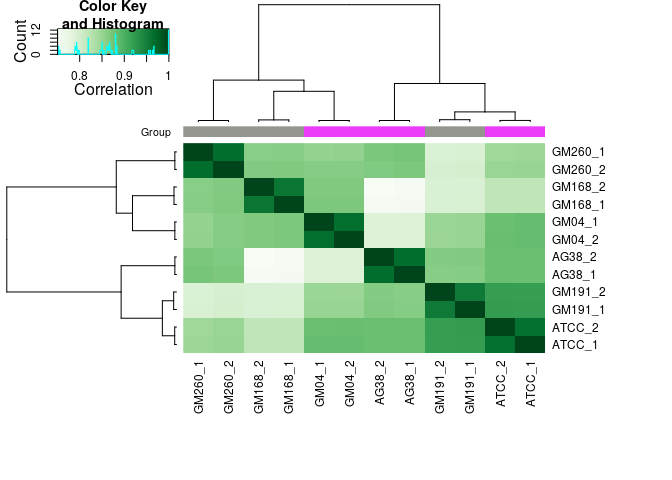<!-- -->

## Count Reads:


```r
# Count reads
atac <- dba.count(atac, summits = 250, bParallel = TRUE)
```

```
## Re-centering peaks...
```

## PCA of ATAC Counts

```r
#save(atac, file = "output/01-atac.dba.Rda")
dba.plotPCA(atac, attributes=DBA_CONDITION)
```

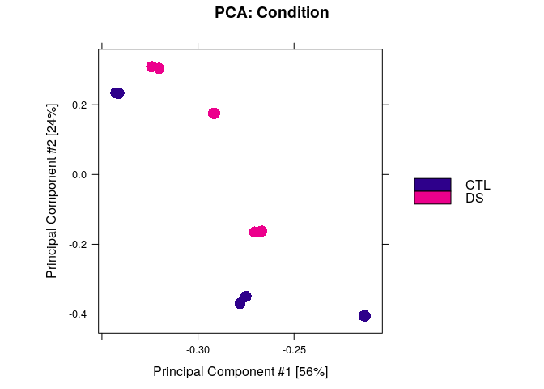<!-- -->

## Differential analysis:  


```r
# Set the contrast
atac <- dba.contrast(atac, categories = DBA_CONDITION)

# Differential analysis.
atac <- dba.analyze(atac, bParallel = TRUE)
atac
```

```
## 12 Samples, 252255 sites in matrix:
##         ID Tissue Condition Replicate Caller Intervals FRiP
## 1  GM168_1  GM168       CTL         1 counts    252255 0.46
## 2  GM191_1  GM191       CTL         1 counts    252255 0.46
## 3  GM260_1  GM260       CTL         1 counts    252255 0.42
## 4   ATCC_1   ATCC        DS         1 counts    252255 0.42
## 5   GM04_1   GM04        DS         1 counts    252255 0.38
## 6   AG38_1   AG38        DS         1 counts    252255 0.43
## 7  GM168_2  GM168       CTL         2 counts    252255 0.46
## 8  GM191_2  GM191       CTL         2 counts    252255 0.46
## 9  GM260_2  GM260       CTL         2 counts    252255 0.42
## 10  ATCC_2   ATCC        DS         2 counts    252255 0.41
## 11  GM04_2   GM04        DS         2 counts    252255 0.38
## 12  AG38_2   AG38        DS         2 counts    252255 0.43
## 
## 1 Contrast:
##   Group1 Members1 Group2 Members2 DB.DESeq2
## 1    CTL        6     DS        6     14339
```

```r
# save(atac, file = "output/atac.dba.Rda")
```

## Heatmap Plot based on DB sites:  


```r
plot(atac, contrast = 1, colSideCols = rev(pal_geno), ColAttributes = DBA_CONDITION)
```

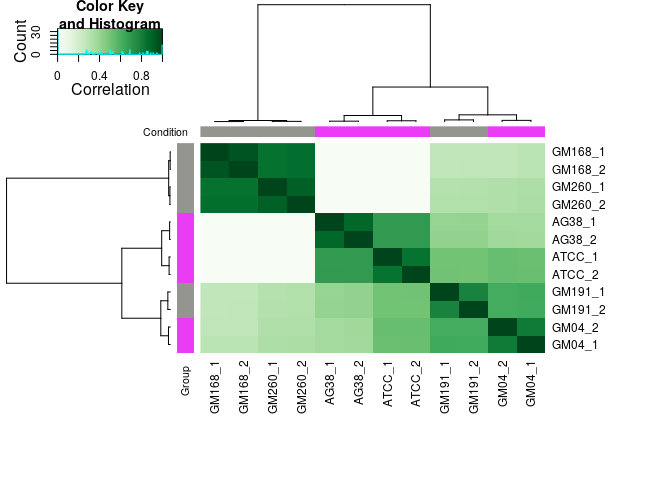<!-- -->

## Retrieve the DB sites:  


```r
atac_db_sites <- dba.report(atac)
atac_db_sites$igv_friendly <- paste0("chr", seqnames(atac_db_sites), ":", start(atac_db_sites), "-", end(atac_db_sites))
# save(atac_db_sites, file = "output/atac_db_sites.granges.Rda")
```

## Number of Sites with Differential Accessiblity:  

```r
length(atac_db_sites)
```

```
## [1] 14339
```

## Write a BED file with DA sites:


```r
# df <- data.frame(seqnames=seqnames(gr),
#   starts=start(gr)-1,
#   ends=end(gr),
#   names=c(rep(".", length(gr))),
#   scores=c(rep(".", length(gr))),
#   strands=strand(gr))
```

## PCA of normalized ATAC signal and Differential Binding


```r
# Using normalized read counts for all binding sites
dba.plotPCA(atac, label = DBA_CONDITION, vCols = pal_geno)
```

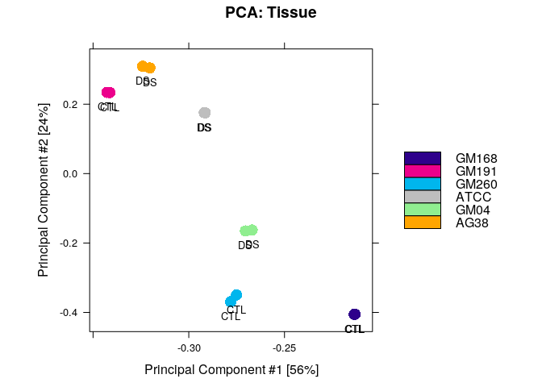<!-- -->

```r
# Using only the differentially-bound sites
dba.plotPCA(atac, contrast = 1, vCols = pal_geno)
```

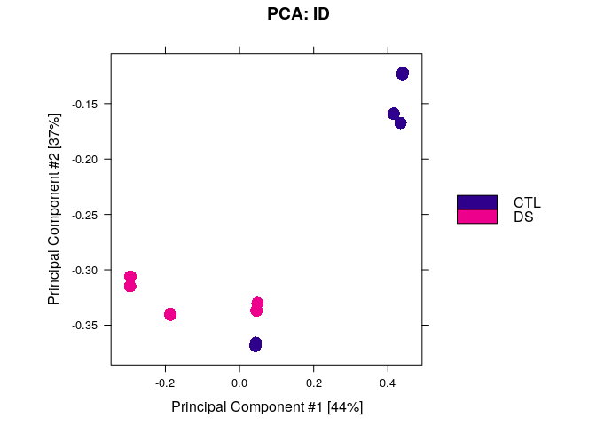<!-- -->


## Volcano and MA plots:  

```r
dba.plotMA(atac)
```

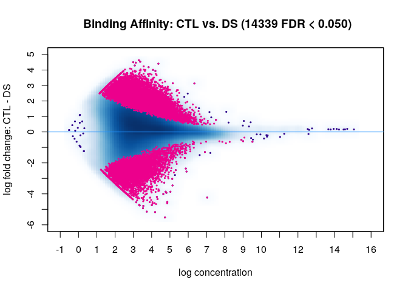<!-- -->

```r
dba.plotMA(atac, bNormalized = FALSE)
```

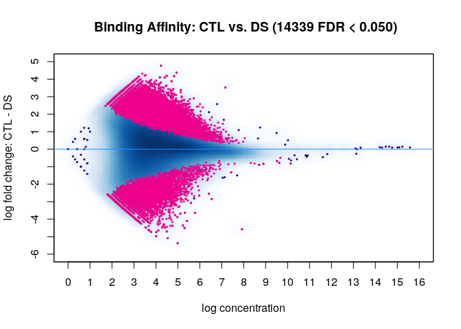<!-- -->


```r
dba.report(atac, th = 1, DataType = "DBA_DATA_FRAME") %>%
  mutate(log10p = -log10(FDR),
         log2fc = -Fold, # To make DS positive
         signif = case_when(
           FDR > 0.05 ~ "Not significant",
           log2fc > 0 ~ "Significantly more accessible",
           log2fc < 0 ~ "Significantly less accessible")) %>%
  ggplot(aes(x = log2fc, y = log10p)) +
  geom_point(aes(colour = signif), alpha = 0.8) +
  scale_colour_manual(values = pal_volcano) +
  #theme_pub() +
  xlab("log2(fold change) (DS/CTL)") + ylab("-log10(adjusted p value)") 
```

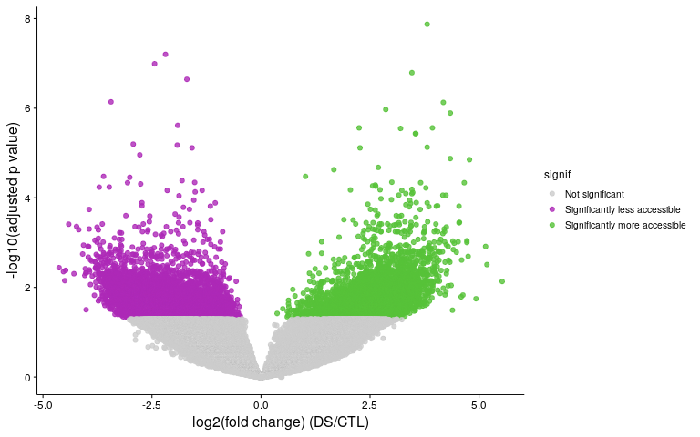<!-- -->

## Annotate Site of Differential Accessiblity:


```r
# First let's rename the chromosomes
chr_ucsc <- mapSeqlevels(seqlevels(atac_db_sites), "UCSC")
atac_db_sites <- renameSeqlevels(atac_db_sites, chr_ucsc)

txdb <- TxDb.Hsapiens.UCSC.hg19.knownGene

anno_db_sites <- annotatePeak(atac_db_sites, tssRegion = c(-2500, 2500), 
                              TxDb = txdb, annoDb = "org.Hs.eg.db")
```

```
## >> preparing features information...		 2020-05-16 12:40:49 PM 
## >> identifying nearest features...		 2020-05-16 12:40:49 PM 
## >> calculating distance from peak to TSS...	 2020-05-16 12:40:50 PM 
## >> assigning genomic annotation...		 2020-05-16 12:40:50 PM 
## >> adding gene annotation...			 2020-05-16 12:41:05 PM
```

```
## Loading required package: org.Hs.eg.db
```

```
## 
```

```
## 'select()' returned 1:many mapping between keys and columns
```

```
## >> assigning chromosome lengths			 2020-05-16 12:41:05 PM 
## >> done...					 2020-05-16 12:41:06 PM
```

```r
# Some stats
anno_db_sites
```

```
## Annotated peaks generated by ChIPseeker
## 14339/14339  peaks were annotated
## Genomic Annotation Summary:
##               Feature  Frequency
## 9    Promoter (<=1kb)  3.6543692
## 10   Promoter (1-2kb)  1.7574447
## 11   Promoter (2-3kb)  0.9345143
## 4              5' UTR  0.4742311
## 3              3' UTR  1.6388870
## 1            1st Exon  0.2371156
## 7          Other Exon  3.0755283
## 2          1st Intron 11.7302462
## 8        Other Intron 29.3674594
## 6  Downstream (<=300)  0.8856964
## 5   Distal Intergenic 46.2445080
```

```r
# Get other formats
anno_db_sites_gr <- as.GRanges(anno_db_sites)
anno_db_sites_df <- as.data.frame(anno_db_sites)

# save(anno_db_sites_gr, anno_db_sites_df, file = "output/anno_db_sites.Rda")
```

## Genomic compartment distribution

```r
plotAnnoPie(anno_db_sites,
            col = c("#646BA8",
              "#ef893b",
              "#e2445e",
              "#5E7A41",
              "#CDD150",
              "#FFFC63",
              "#5DAD3B",
              "#6E3688",
              "#A2ACD3",
              "#EBD9A7",
              "#BEBEBE"))
```

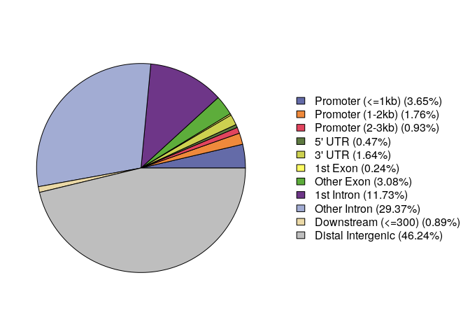<!-- -->
# Peaks in promoter regions

From the peak annotation, about 3% of peaks fall in the <=1kbp promoter category,
i.e. falling within 1kbp (upstream or downstream) of the gene TSS. 6.3% fall
within 3kbp of TSS. We'll write these out to TSV files.


```r
prom1kb <- anno_db_sites_df %>%
  filter(annotation == "Promoter (<=1kb)") %>% 
  dplyr::select(SYMBOL, everything())

write_tsv(prom1kb, "output/02-atac_db_sites.1kb_promoters.tsv")
```


```r
# Note that this df only contains significant da sites (at an FDR threshold of 0.5)
anno_db_sites_df %>%
  filter(grepl("Promoter", annotation)) %>%
  write_tsv("output/02-atac_db_sites.3kb_promoters.tsv")

# How many unique genes?
anno_db_sites_df %>%
  filter(grepl("Promoter", annotation)) %>% 
  .$SYMBOL %>% 
  unique() %>% 
  length()
```

```
## [1] 846
```

## Manhattan Plot of Differntially Accessible Sites 
### Manhattan Setup

```r
manhattan_df <- dba.report(atac, th = 1, DataType = "DBA_DATA_FRAME") %>%
  mutate(log10p = -log10(FDR),
         log2fc = -Fold, # To make DS positive
         signif = case_when(
           FDR > 0.05 ~ "Not significant",
           log2fc > 0 ~ "Significantly more accessible",
           log2fc < 0 ~ "Significantly less accessible"))
```
  

```r
manhattan_df <- manhattan_df %>%
  group_by(Chr) %>% 
  mutate(rank = rank(Start)) %>% 
  filter(Chr %in% as.character(seq(1, 22))) %>% 
  mutate(chromosome_name2 = as.numeric(Chr))

manhattan_df <- manhattan_df %>% 
  group_by(chromosome_name2) %>% 
  summarise(chr_len = max(rank)) %>% 
  mutate(tot = cumsum(chr_len) - chr_len) %>% 
  dplyr::select(-chr_len) %>% 
  left_join(manhattan_df, ., by = "chromosome_name2") %>% 
  arrange(chromosome_name2, rank) %>%
  mutate(bp_cum = rank + tot)

write_tsv(manhattan_df, "output/manhattan_input.tsv")

axis_df <- manhattan_df %>%
  group_by(chromosome_name2) %>%
  summarize(center = ( max(bp_cum) + min(bp_cum) ) / 2 ,
            start = min(bp_cum),
            end = max(bp_cum))
```

### Make Manhattan Figure:  

```r
manhattan_df %>%
  mutate(group = factor(signif, levels = c("Significantly more accessible", "Significantly less accessible", "Not significant"))) %>% 
  arrange(signif) %>% 
  ggplot(aes(x = bp_cum, y = log2fc)) +
  # colour background
  annotate("rect", xmin = axis_df$start, xmax = axis_df$end,
           ymin = -5, ymax = 5,
           alpha = 0.2,
           fill = rep(c("azure3", "white"), 11)) +
  # Show all points
  geom_point( aes(color=group), size = 1.3, alpha = 0.8) +
  scale_colour_manual(values = pal_volcano) +
  # custom X axis:
  scale_x_continuous(label = axis_df$chromosome_name2, breaks = axis_df$center) +
  scale_y_continuous(expand = c(0, 0)) + # remove space between plot area and x axis
  # Custom the theme:
  theme_pub() +
  theme( 
    # legend.position="none",
    panel.border = element_blank(),
    panel.grid.major.x = element_blank(),
    panel.grid.minor.x = element_blank()
  ) +
  xlab("Chromosome") +
  ylab("Fold Change") +
  ylim(c(-5, 5)) +
  ggtitle("Manhattan plot")
```

```
## Scale for 'y' is already present. Adding another scale for 'y', which
## will replace the existing scale.
```

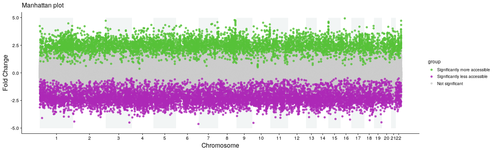<!-- -->

# Prep regions for deepTools

For analysis of the accessibility signal profiles in regions and genes of interest,
we will use deepTools to generate some visualizations. As input, it requires
regions in which to plot signal, so we generate that based on the RNA-seq and
ATAC-seq data here.

First, pull the differentially-expressed genes:


```r
rnaseq <- read_tsv("../RNA-seq/output/DESeq_results.tsv")

de_genes <- rnaseq %>% 
  filter(padj < 0.05)

de_genes %>% 
  dplyr::select(chromosome_name, start_position, end_position) %>% 
  write_tsv("output/RNAseq_de_genes.bed", col_names = FALSE)
```


Let's also take the highly DE genes, i.e. with a large fold change.

```r
de_genes %>% 
  filter(log2FoldChange > log2(2)) %>%
  dplyr::select(chromosome_name, start_position, end_position) %>%
  write_tsv("output/RNAseq_de_genes.up_lfc_threshold.bed", col_names = FALSE)

de_genes %>% 
  filter(log2FoldChange < log2(2)) %>%
  dplyr::select(chromosome_name, start_position, end_position) %>%
  write_tsv("output/RNAseq_de_genes.down_lfc_threshold.bed", col_names = FALSE)
```
And the peaks:


```r
seqlevelsStyle(anno_db_sites_gr) <- "NCBI"

anno_db_sites_gr %>% rtracklayer::export.bed("output/atac_db_sites.bed")
anno_db_sites_gr[seqnames(anno_db_sites_gr) == '21'] %>% rtracklayer::export.bed("output/atac_db_sites.chr21.bed")
```

DB peaks in promoters:


```r
anno_db_sites_gr[grepl("Promoter", anno_db_sites_gr$annotation)] %>%
  rtracklayer::export.bed("output/atac_db_sites.promoters.bed")
```


# deepTools  
## Mean ATAC signal 1kb upstream of differntially expressed genes
Here we use [computeMatrix](https://deeptools.readthedocs.io/en/develop/content/tools/computeMatrix.html) to compute DA signal 1kb upstream of the TSS of differentially expressed genes. Note that the output from computematrix produces a tab delimited file with shifted headers.


```bash
./signal_upstream_DE_genes.sh
```

```
## Skipping 18:79964582-79970822, due to being absent in the computeMatrix output.
## Skipping 20:63488014-63499185, due to being absent in the computeMatrix output.
## Skipping 17:81681174-81683924, due to being absent in the computeMatrix output.
## Skipping 18:79069285-79378287, due to being absent in the computeMatrix output.
## Skipping 20:63400210-63472677, due to being absent in the computeMatrix output.
```

## Violin Plots of ATAC signal upstream of differntially expressed genes

```r
# read the data without a header
atac_signal_up <- read_tsv("output/up_de_genes_matrix.tab",  skip = 3, col_names = FALSE)
atac_signal_down <- read_tsv("output/down_de_genes_matrix.tab",  skip = 3, col_names = FALSE)
# read the column names
up_col_names <-read_tsv("output/up_de_genes_matrix.tab",  skip=2, col_names = FALSE, n_max = 1)
down_col_names <-read_tsv("output/down_de_genes_matrix.tab",  skip=2, col_names = FALSE, n_max = 1)
# add column names with first erroneous entry
colnames(atac_signal_up) <-unlist(up_col_names[-1], use.names=FALSE)
colnames(atac_signal_down) <-unlist(down_col_names[-1], use.names=FALSE)
```


```r
atac_signal_up <- atac_signal_up %>%
  tibble::rowid_to_column(var = "gene_idx") %>%
  gather(sample, signal, 2:length(.)) %>%
  separate(sample, into = c("drop", "sample"), sep = "_") %>%
  left_join(samples, by = c("sample" = "Cell_Line"))


atac_signal_up %>%
  filter(signal < 200) %>%
  group_by(Condition, gene_idx) %>%
  summarise(signal = mean(signal)) %>%
  ggplot(aes(x = Condition, y = signal)) +
  geom_violin(aes(fill = Condition)) +
  scale_fill_manual(values = pal_geno) +
  geom_jitter(size = 0.5, alpha = 0.2) +
  ggtitle("Upregulated genes")
```

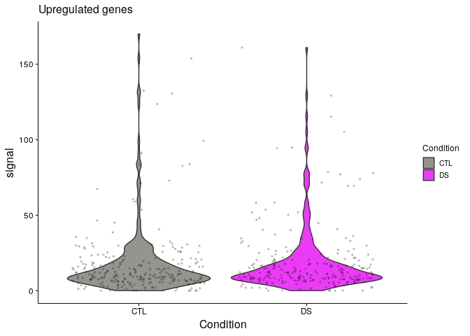<!-- -->


```r
atac_signal_down <- atac_signal_down %>%
  tibble::rowid_to_column(var = "gene_idx") %>%
  gather(sample, signal, 2:length(.)) %>%
  separate(sample, into = c("drop", "sample"), sep = "_") %>%
  left_join(samples, by = c("sample" = "Cell_Line"))

atac_signal_down %>%
  filter(signal < 200) %>%
  group_by(Condition, gene_idx) %>%
  summarise(signal = mean(signal)) %>%
  ggplot(aes(x = Condition, y = signal)) +
  geom_violin(aes(fill = Condition)) +
  scale_fill_manual(values = pal_geno) +
  geom_jitter(size = 0.5, alpha = 0.2) +
  ggtitle("Downregulated genes")
```

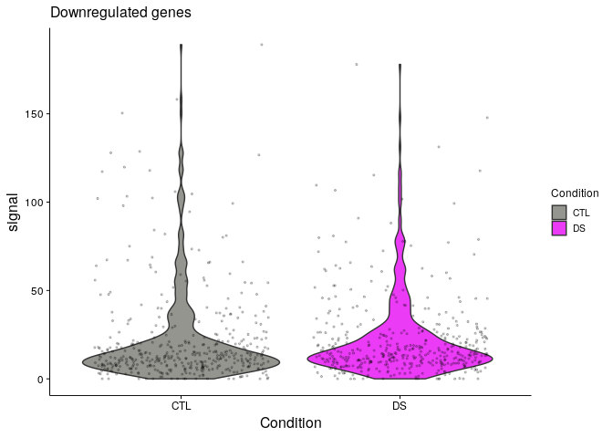<!-- -->
# deepTools 2  
## Annotate Diiferntailly accessible promoters
Here we use [computeMatrix](https://deeptools.readthedocs.io/en/develop/content/tools/computeMatrix.html) to identify the genes that have differntially accessible promoters. This data will be used downstream to perform gene ontolgy analysis.


```bash
./DB_peaks_in_promoters.sh
```

```
## WARNING: Group 'cluster_1' is too small for plotting, you might want to remove it. There will likely be an error message from matplotlib regarding this below.
```


## Read deepTools Data and join with annotations

```r
## Calculated in March 2020
db_prom_clust <- read_tsv("output/db_peaks.sorted_kmeans.txt") %>%
  mutate(start = start + 1) %>%
  mutate(igv_friendly = paste0("chr", `#chrom`, ":", start, "-", `end`)) %>%
  left_join(anno_db_sites_df, by = "igv_friendly")
```

## Gene Ontology

  

```r
db_prom_clust_multiomic <- db_prom_clust %>%
  left_join(rnaseq, by = c("SYMBOL" = "gene")) %>%
  mutate(RNAseq_LFC = log2FoldChange) %>%
  filter(!is.na(padj)) %>%
  mutate(signif = ifelse(padj < 0.05, "Signif", "Not signif"))

go_all2 <- enrichGO(db_prom_clust_multiomic$geneId,
         OrgDb = "org.Hs.eg.db",
         ont = "all",
         readable = TRUE)

# save(go_all, file = "output/02-enrichGO_results_all.Rda")
go_all_top2 <- go_all2@result %>% 
  rename(N_associated_genes = Count) %>%
  mutate(log10padj = -log10(p.adjust)) %>%
  group_by(ONTOLOGY) %>% 
  # Get top 5 terms
  arrange(desc(log10padj)) %>%
  slice(1:5) %>% 
  ungroup()

go_all_top2 %>% 
  arrange(N_associated_genes) %>% 
  mutate(Description = factor(Description, levels = unique(.$Description))) %>% 
  ggplot(aes(x = Description, y = N_associated_genes)) +
  geom_bar(stat = "identity", aes(fill = log10padj), colour = "black", width = 0.5) +
  scale_fill_gradientn(colours = RColorBrewer::brewer.pal(8, "Greens")) +
  facet_wrap(~ ONTOLOGY, scales = "free_y", ncol = 1) +
  ylab("Number of associated genes") + xlab("GO Term") +
  coord_flip() +
  theme_pub() +
  labs(fill = "-log10 adjusted p-value (rank by p-val)") +
  ggtitle("Calculated March 2020")
```

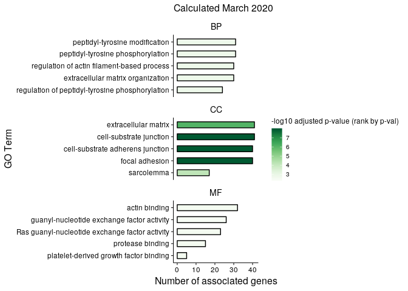<!-- -->

# Supplementary Data  
  
## Filter Differential Accessibilty to Differentially Expressed Genes (by RNA-seq):


```r
de_genes <- rnaseq %>% 
  filter(padj < 0.05) %>%
  arrange(desc(log2FoldChange))

db_sites_in_de_genes <- anno_db_sites_df %>% filter(SYMBOL %in% de_genes$gene)
```


## Compare ATAC-seq and RNA-seq  

We'll start by focusing on looking at chromatin accessibility in promoter regions of genes.
We took differentially accesible peaks, and plot them against the RNAseq fold change
of these genes.


```r
# Filter and join
multiomic <- anno_db_sites_df %>%
  mutate(ATACseq_LFC = -Fold) %>% 
  left_join(rnaseq, by = c("SYMBOL" = "gene")) %>% 
  mutate(RNAseq_LFC = log2FoldChange)

da_pks_in_de_genes <- multiomic %>%
  filter(SYMBOL %in% de_genes$gene)

plotATACvsRNA <- function(df, threshold = 2) {
  
  df <- df %>% 
    mutate(relation = case_when((RNAseq_LFC > threshold & ATACseq_LFC > threshold) |
                                  (RNAseq_LFC < -threshold & ATACseq_LFC < -threshold) ~ "agreement",
                                (RNAseq_LFC > threshold & ATACseq_LFC < -threshold) |
                                  (RNAseq_LFC < -threshold & ATACseq_LFC > threshold) ~ "disagreement",
                                TRUE ~ "none"))
  
  df %>% 
    arrange(relation) %>% 
    ggplot(aes(x = RNAseq_LFC, y = ATACseq_LFC)) +
    geom_point(alpha = 0.8, aes(colour = relation)) +
    xlim(-4, 4) + ylim(-4, 4) +
    scale_colour_manual(values = c("agreement" = "blue", "none" = "gray80", "disagreement" = "red")) +
    geom_text_repel(data = filter(df, grepl("agreement", relation)),
                    aes(x = RNAseq_LFC, y = ATACseq_LFC, label = SYMBOL),
                    size = 3) +
    theme_pub()
  
}

multiomic %>% 
  filter(grepl("Promoter", annotation)) %>%
  plotATACvsRNA(threshold = 1) +
   ggtitle("Fold change concordance in differentially accesessible peaks \nwithin 3kbp of gene TSS")
```

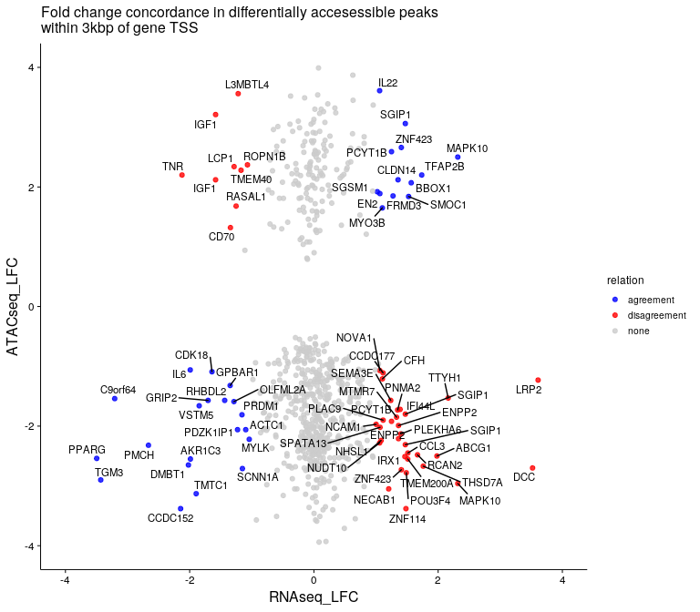<!-- -->

## Session Info  

```r
sessionInfo()
```

```
## R version 3.5.0 (2018-04-23)
## Platform: x86_64-pc-linux-gnu (64-bit)
## Running under: Ubuntu 19.10
## 
## Matrix products: default
## BLAS: /usr/lib/x86_64-linux-gnu/blas/libblas.so.3.8.0
## LAPACK: /usr/lib/x86_64-linux-gnu/lapack/liblapack.so.3.8.0
## 
## locale:
##  [1] LC_CTYPE=en_CA.UTF-8       LC_NUMERIC=C              
##  [3] LC_TIME=en_CA.UTF-8        LC_COLLATE=en_CA.UTF-8    
##  [5] LC_MONETARY=en_CA.UTF-8    LC_MESSAGES=en_CA.UTF-8   
##  [7] LC_PAPER=en_CA.UTF-8       LC_NAME=C                 
##  [9] LC_ADDRESS=C               LC_TELEPHONE=C            
## [11] LC_MEASUREMENT=en_CA.UTF-8 LC_IDENTIFICATION=C       
## 
## attached base packages:
## [1] parallel  stats4    stats     graphics  grDevices utils     datasets 
## [8] methods   base     
## 
## other attached packages:
##  [1] org.Hs.eg.db_3.7.0                     
##  [2] bindrcpp_0.2.2                         
##  [3] clusterProfiler_3.10.1                 
##  [4] knitr_1.21                             
##  [5] ggrepel_0.8.0                          
##  [6] forcats_0.3.0                          
##  [7] stringr_1.3.1                          
##  [8] dplyr_0.7.7                            
##  [9] purrr_0.2.5                            
## [10] readr_1.3.1                            
## [11] tidyr_0.8.2                            
## [12] tibble_1.4.2                           
## [13] ggplot2_3.1.0                          
## [14] tidyverse_1.2.1                        
## [15] TxDb.Hsapiens.UCSC.hg19.knownGene_3.2.2
## [16] GenomicFeatures_1.34.3                 
## [17] AnnotationDbi_1.44.0                   
## [18] ChIPseeker_1.18.0                      
## [19] DiffBind_2.10.0                        
## [20] SummarizedExperiment_1.12.0            
## [21] DelayedArray_0.8.0                     
## [22] BiocParallel_1.16.6                    
## [23] matrixStats_0.54.0                     
## [24] Biobase_2.42.0                         
## [25] GenomicRanges_1.34.0                   
## [26] GenomeInfoDb_1.18.1                    
## [27] IRanges_2.16.0                         
## [28] S4Vectors_0.20.1                       
## [29] BiocGenerics_0.28.0                    
## [30] RColorBrewer_1.1-2                     
## [31] magrittr_1.5                           
## 
## loaded via a namespace (and not attached):
##   [1] tidyselect_0.2.5         RSQLite_2.1.1           
##   [3] htmlwidgets_1.3          grid_3.5.0              
##   [5] BatchJobs_1.7            munsell_0.5.0           
##   [7] units_0.6-2              systemPipeR_1.16.1      
##   [9] withr_2.1.2              colorspace_1.4-0        
##  [11] GOSemSim_2.8.0           Category_2.48.0         
##  [13] highr_0.7                rstudioapi_0.9.0        
##  [15] DOSE_3.8.2               labeling_0.3            
##  [17] urltools_1.7.2           GenomeInfoDbData_1.2.0  
##  [19] hwriter_1.3.2            bit64_0.9-7             
##  [21] farver_1.1.0             pheatmap_1.0.12         
##  [23] generics_0.0.2           xfun_0.12               
##  [25] R6_2.3.0                 locfit_1.5-9.1          
##  [27] bitops_1.0-6             fgsea_1.8.0             
##  [29] gridGraphics_0.3-0       assertthat_0.2.0        
##  [31] scales_1.0.0             ggraph_1.0.2            
##  [33] nnet_7.3-12              enrichplot_1.2.0        
##  [35] gtable_0.2.0             rlang_0.4.0             
##  [37] genefilter_1.64.0        BBmisc_1.11             
##  [39] splines_3.5.0            rtracklayer_1.42.1      
##  [41] lazyeval_0.2.1           acepack_1.4.1           
##  [43] broom_0.5.1              europepmc_0.3           
##  [45] brew_1.0-6               checkmate_1.9.1         
##  [47] yaml_2.2.0               reshape2_1.4.3          
##  [49] modelr_0.1.3             backports_1.1.3         
##  [51] qvalue_2.14.1            Hmisc_4.2-0             
##  [53] RBGL_1.58.1              tools_3.5.0             
##  [55] ggplotify_0.0.3          gridBase_0.4-7          
##  [57] gplots_3.0.1.1           ggridges_0.5.1          
##  [59] Rcpp_1.0.0               plyr_1.8.4              
##  [61] base64enc_0.1-3          progress_1.2.0          
##  [63] zlibbioc_1.28.0          RCurl_1.95-4.11         
##  [65] prettyunits_1.0.2        rpart_4.1-13            
##  [67] viridis_0.5.1            cowplot_0.9.4           
##  [69] haven_2.0.0              cluster_2.0.7-1         
##  [71] data.table_1.12.0        DO.db_2.9               
##  [73] triebeard_0.3.0          amap_0.8-16             
##  [75] hms_0.4.2                evaluate_0.12           
##  [77] xtable_1.8-3             XML_3.98-1.16           
##  [79] readxl_1.2.0             gridExtra_2.3           
##  [81] compiler_3.5.0           biomaRt_2.38.0          
##  [83] KernSmooth_2.23-15       crayon_1.3.4            
##  [85] htmltools_0.4.0          GOstats_2.48.0          
##  [87] Formula_1.2-3            geneplotter_1.60.0      
##  [89] sendmailR_1.2-1          lubridate_1.7.4         
##  [91] DBI_1.0.0                tweenr_1.0.1            
##  [93] MASS_7.3-49              boot_1.3-20             
##  [95] ShortRead_1.40.0         Matrix_1.2-14           
##  [97] cli_1.0.1                gdata_2.18.0            
##  [99] bindr_0.1.1              igraph_1.2.2            
## [101] pkgconfig_2.0.2          rvcheck_0.1.3           
## [103] GenomicAlignments_1.18.1 foreign_0.8-70          
## [105] xml2_1.2.0               annotate_1.60.0         
## [107] XVector_0.22.0           AnnotationForge_1.24.0  
## [109] rvest_0.3.2              digest_0.6.16           
## [111] graph_1.60.0             Biostrings_2.50.2       
## [113] rmarkdown_1.11           cellranger_1.1.0        
## [115] fastmatch_1.1-0          htmlTable_1.13.1        
## [117] edgeR_3.24.3             GSEABase_1.44.0         
## [119] Rsamtools_1.34.1         gtools_3.8.1            
## [121] rjson_0.2.20             nlme_3.1-137            
## [123] jsonlite_1.6             viridisLite_0.3.0       
## [125] limma_3.38.3             pillar_1.3.1            
## [127] lattice_0.20-35          httr_1.4.0              
## [129] plotrix_3.7-4            survival_2.41-3         
## [131] GO.db_3.7.0              glue_1.3.0              
## [133] UpSetR_1.3.3             bit_1.1-14              
## [135] Rgraphviz_2.26.0         ggforce_0.1.3           
## [137] stringi_1.2.4            blob_1.1.1              
## [139] DESeq2_1.22.2            latticeExtra_0.6-28     
## [141] caTools_1.17.1.1         memoise_1.1.0
```

