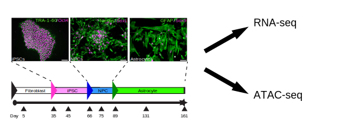

This repository contains all of the code necessary to reproduce the sequencing analysis in Ponroy et al, 2020 [(Pubmed entry)](https://www.ncbi.nlm.nih.gov/pubmed/31943018).
The sequence data can be found at the NCBI Sequence Read Archive under [BioProject PRJNA600245](https://www.ncbi.nlm.nih.gov/bioproject/600245). 
  
---  
  
# **Human iPSC-Derived Down Syndrome Astrocytes Display Genome-Wide Perturbations in Gene Expression, an Altered Adhesion Profile, and Increased Cellular Dynamics.**

### Blandine Ponroy Bally, W. Todd Farmer, Emma V. Jones, Selin Jessa, J. Benjamin Kacerovsky, Alexandre Mayran, Huashan Peng, Julie L. Lefebvre, Jacques Drouin, Arnold Hayer, Carl Ernst, and Keith K. Murai  

ABSTRACT

Down Syndrome (DS), caused by the triplication of human chromosome 21, leads to significant
alterations in brain development and is a major genetic cause of intellectual disability. While much
is known about changes to neurons in DS, the effects of trisomy 21 on non-neuronal cells such as
astrocytes are poorly understood. Astrocytes are critical for brain development and function, and
their alteration may contribute to DS pathophysiology. To better understand the impact of trisomy
21 on astrocytes, we performed RNA-sequencing on astrocytes from newly produced DS human
induced pluripotent stem cells (hiPSCs). While chromosome 21 genes were upregulated in DS
astrocytes, we found consistent up- and down-regulation of genes across the genome with a strong
dysregulation of neurodevelopmental, cell adhesion, and extracellular matrix molecules. ATAC
(Assay for Transposase-Accessible Chromatin)-seq also revealed a global alteration in chromatin
state in DS astrocytes, showing modified chromatin accessibility at promoters of cell adhesion and
extracellular matrix genes. Along with these transcriptomic and epigenomic changes, DS
astrocytes displayed perturbations in cell size and cell spreading as well as modifications to cellcell
and cell-substrate recognition/adhesion, and increases in cellular motility and dynamics. Thus,
triplication of chromosome 21 is associated with genome-wide transcriptional, epigenomic, and
functional alterations in astrocytes that may contribute to altered brain development and function in DS.
 

 
  
---
  
# Overview  
RNA-seq and ATAC-seq were performed on human IPSC-derived astrocytes from DS and control patients.

# Subdirectories  

## RNA-seq  
Contains the RNA-seq pipeline
  
## ATAC-seq
Contains the ATAC-seq pipeline
