# Introduction  

This document records all the RNA-seq analysis presented in Ponroy Bally et al, including loading the
counts matrix derived from pre-processing of the RNA-seq data, performing differential expression and other analysis,
and producing the figures presented in the paper.

# Set up

## Load libraries:


```r
library(ggrepel)
library(glue)
library(venn)
library(cowplot)
library(magrittr)
library(readxl)
library(clusterProfiler)
library(org.Hs.eg.db)
library(DESeq2)
library(biomaRt)
library(pheatmap)
library(Rtsne)
library(karyoploteR)
library(tidyverse)
library(knitr)

source("../functions.R")
ggplot2::theme_set(theme_pub())
```

## Load data

First we load in the metadata describing the samples, and the counts matrix, generated using HTSeq:


```r
metadata <- read.csv("data/rna-seq_meta.csv")


metadata <- metadata %>%
  arrange(sample)

counts  <- read.csv("data/htseq_counts.tsv", sep="\t", ) %>%
  dplyr::select(-1) %>% 
  as.data.frame() %>% 
  tibble::column_to_rownames(var = "gene") %>%
  select(sort.list(colnames(.))) %>%
  magrittr::set_colnames(metadata$sample)

# Reorder samples in the metadata and counts matrix
metadata <- metadata %>%
  arrange(genotype, cell_type, protocol)

counts <- counts[, metadata$sample]
kable(metadata, format = "markdown", caption="Sample Metadata")
```


|sample           |cell_type |protocol |genotype  |sample_number |
|:----------------|:---------|:--------|:---------|:-------------|
|GM22168 A1 (CTL) |GM22168   |CNTF     |control   |1-8           |
|GM22168 A2 (CTL) |GM22168   |CNTF     |control   |2-8           |
|GM22168 B1 (CTL) |GM22168   |EGF      |control   |1-3           |
|GM22168 B2 (CTL) |GM22168   |EGF      |control   |2-2           |
|GM22191 A1 (CTL) |GM22191   |CNTF     |control   |1-9           |
|GM22191 A2 (CTL) |GM22191   |CNTF     |control   |2-9           |
|GM22191 B1 (CTL) |GM22191   |EGF      |control   |1-1           |
|GM22191 B2 (CTL) |GM22191   |EGF      |control   |2-3           |
|GM22260 A1 (CTL) |GM22260   |CNTF     |control   |1-10          |
|GM22260 A2 (CTL) |GM22260   |CNTF     |control   |2-10          |
|GM22260 B1 (CTL) |GM22260   |EGF      |control   |1-2           |
|GM22260 B2 (CTL) |GM22260   |EGF      |control   |2-4           |
|AG07438 A1 (DS)  |AG07438   |CNTF     |trisomy21 |1-12          |
|AG07438 A2 (DS)  |AG07438   |CNTF     |trisomy21 |2-11          |
|AG07438 B1 (DS)  |AG07438   |EGF      |trisomy21 |1-5           |
|AG07438 B2 (DS)  |AG07438   |EGF      |trisomy21 |2-5           |
|ATCC A1 (DS)     |ATCC      |CNTF     |trisomy21 |1-11          |
|ATCC A2 (DS)     |ATCC      |CNTF     |trisomy21 |2-12          |
|ATCC B1 (DS)     |ATCC      |EGF      |trisomy21 |1-6           |
|ATCC B2 (DS)     |ATCC      |EGF      |trisomy21 |2-6           |
|GM2504 A1 (DS)   |GM2504    |CNTF     |trisomy21 |1-7           |
|GM2504 A2 (DS)   |GM2504    |CNTF     |trisomy21 |2-7           |
|GM2504 B1 (DS)   |GM2504    |EGF      |trisomy21 |1-4           |
|GM2504 B2 (DS)   |GM2504    |EGF      |trisomy21 |2-1           |

## Palettes

Set some palettes for the analysis:


```r
pal_sample <- rep(NA, length(metadata$sample))
names(pal_sample) <- metadata$sample

pal_sample[grep("GM2504",  names(pal_sample))] <- rgb(236, 86, 247, maxColorValue = 255)
pal_sample[grep("AG07438", names(pal_sample))] <- rgb(240, 142, 249, maxColorValue = 255)
pal_sample[grep("ATCC",    names(pal_sample))] <- rgb(205, 137, 248, maxColorValue = 255)
pal_sample[grep("GM22191", names(pal_sample))] <- rgb(0, 0, 0, maxColorValue = 255)
pal_sample[grep("GM22260", names(pal_sample))] <- rgb(217, 217, 217, maxColorValue = 255)
pal_sample[grep("GM22168", names(pal_sample))] <- rgb(127, 127, 127, maxColorValue = 255)

pal_gm <- colorRampPalette(c("magenta", "black", "green"))(100)

pal_rb <- colorRampPalette(rev(RColorBrewer::brewer.pal(8, "RdBu")))(100)

pal_cell_type <- c("AG07438" = rgb(240, 142, 249, maxColorValue = 255),
                   "ATCC"    = rgb(205, 137, 248, maxColorValue = 255),
                   "GM2504"  = rgb(236, 86, 247, maxColorValue = 255),
                   "GM22168" = rgb(127, 127, 127, maxColorValue = 255),
                   "GM22191" = rgb(0, 0, 0, maxColorValue = 255),
                   "GM22260" = rgb(217, 217, 217, maxColorValue = 255))

pal_geno <- c("#EB3BF7", "#93958E")
names(pal_geno) <- c("trisomy21", "control")

pal_extremes <- c(rgb(173, 41, 182, maxColorValue = 255), # magenta
                  rgb(86, 194, 57, maxColorValue = 255))  # green

pal_volcano <- c(pal_extremes, "gray80")
names(pal_volcano) <- c("Significantly down-regulated",
                        "Significantly up-regulated",
                        "Not significant")

# To use for heatmap annotation
anno <- data.frame(sample    = metadata$sample,
                   cell_type = metadata$cell_type)
rownames(anno) <- metadata$sample
```

# Normalization with DESeq2

## Create the DESeq object:


```r
dds <- DESeqDataSetFromMatrix(
  countData = counts,
  colData   = metadata,
  design    = ~ genotype)

# Minimal pre-filtering:
keep_rows <- rowSums(counts(dds)) > 1
dds       <- dds[keep_rows, ]

# Set the factor levels for the comparison:
dds$genotype <- factor(dds$genotype, levels = c("control", "trisomy21"))

dds
```

```
## class: DESeqDataSet 
## dim: 33503 24 
## metadata(1): version
## assays(1): counts
## rownames(33503): 5S_rRNA 7SK ... snoZ5 yR211F11.2
## rowData names(0):
## colnames(24): GM22168 A1 (CTL) GM22168 A2 (CTL) ... GM2504 B1 (DS)
##   GM2504 B2 (DS)
## colData names(5): sample cell_type protocol genotype sample_number
```

## Transform the data using the variance stabilizing transformation:


```r
vst_data <- varianceStabilizingTransformation(dds, blind = FALSE)
head(assay(vst_data), 3)
```

```
##         GM22168 A1 (CTL) GM22168 A2 (CTL) GM22168 B1 (CTL) GM22168 B2 (CTL)
## 5S_rRNA         1.469772         2.372694         1.469772         2.724159
## 7SK             3.374060         3.676390         4.862553         3.671245
## A1BG            3.911971         3.676390         4.502478         3.837044
##         GM22191 A1 (CTL) GM22191 A2 (CTL) GM22191 B1 (CTL) GM22191 B2 (CTL)
## 5S_rRNA         2.573855         3.199650         3.080949         2.663815
## 7SK             3.160047         3.918240         3.558284         2.663815
## A1BG            4.474015         2.988201         4.300087         4.183491
##         GM22260 A1 (CTL) GM22260 A2 (CTL) GM22260 B1 (CTL) GM22260 B2 (CTL)
## 5S_rRNA         2.397253         1.469772         1.469772         2.435864
## 7SK             3.426189         3.523879         2.999247         2.812693
## A1BG            4.181792         3.904199         3.211933         4.539640
##         AG07438 A1 (DS) AG07438 A2 (DS) AG07438 B1 (DS) AG07438 B2 (DS)
## 5S_rRNA        2.744655        2.189689        1.469772        2.255009
## 7SK            2.927448        3.154230        3.672778        3.420917
## A1BG           4.466845        4.152387        3.864397        3.293214
##         ATCC A1 (DS) ATCC A2 (DS) ATCC B1 (DS) ATCC B2 (DS) GM2504 A1 (DS)
## 5S_rRNA     3.535373     2.472293     2.302145     2.846040       2.361880
## 7SK         3.981912     3.145530     2.875314     1.469772       3.653371
## A1BG        3.535373     3.567197     4.201050     4.226345       4.097382
##         GM2504 A2 (DS) GM2504 B1 (DS) GM2504 B2 (DS)
## 5S_rRNA       2.708935       1.469772       2.626683
## 7SK           3.647295       3.574850       3.384150
## A1BG          3.992623       4.182289       4.402263
```

```r
assay(vst_data) %>% as.data.frame %>%
  tibble::rownames_to_column(var = "gene") %>%
  write_tsv("output/vst_data.tsv")
```

# Overview of global relationships

Next, we perform clustering and dimensionality reduction based on the data to get an
overview of global patterns in the data.

## Heatmap of pairwise distances between samples:


```r
hvg_vst      <- getHVG(vst_data, 1000)
mat_hvg_vst  <- assay(vst_data)[hvg_vst, ]
dist_hvg_vst <- as.matrix(dist(t(mat_hvg_vst)))

pheatmap(dist_hvg_vst,
         color = pal_gm,
         annotation_col = dplyr::select(anno, -sample),
         annotation_names_col = FALSE,
         annotation_colors = list(cell_type = pal_cell_type),
         annotation_legend = FALSE,
         fontsize = 8,
         border_color = NA)
```

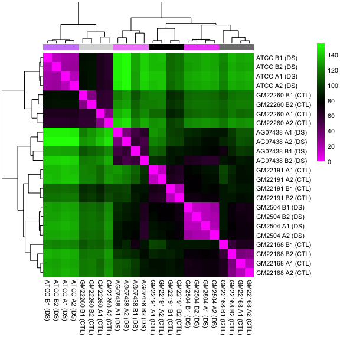<!-- -->


## PCA Analysis

```r
pcaData <- plotPCA(vst_data, intgroup=c("genotype"), ntop = 500, returnData=TRUE)
percentVar <- round(100 * attr(pcaData, "percentVar"))
pcaData <- pcaData %>% separate(name, 'cell_type', ' ', remove=FALSE)
ggplot(pcaData, aes(PC1, PC2, color=cell_type, shape=genotype)) +
  geom_point(size=10) +
  scale_color_manual(values = pal_cell_type) + 
  xlab(paste0("PC1: ",percentVar[1],"% variance")) +
  ylab(paste0("PC2: ",percentVar[2],"% variance")) + 
  theme(axis.text.x = element_text(size = 18), 
        axis.text.y = element_text(size = 18),
        axis.title.x = element_text(size = 18),
        axis.title.y = element_text(size = 18))
```

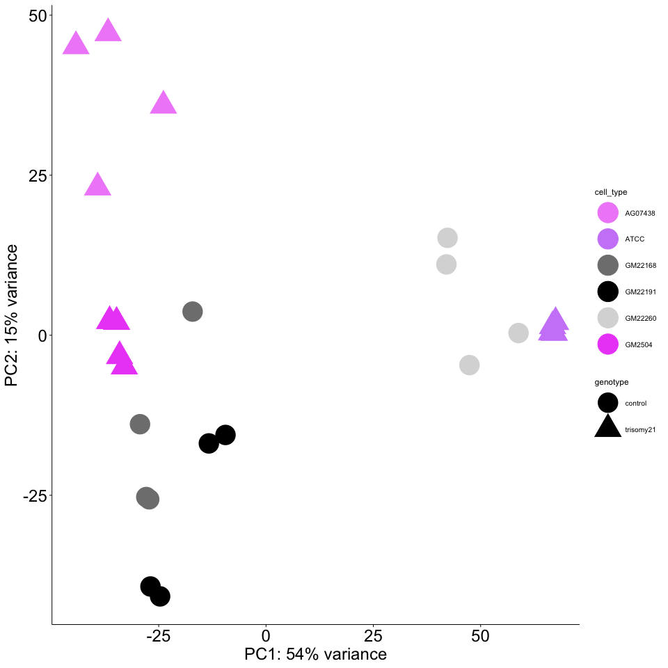<!-- -->

```r
  coord_fixed()
```

```
## <ggproto object: Class CoordFixed, CoordCartesian, Coord, gg>
##     aspect: function
##     backtransform_range: function
##     clip: on
##     default: FALSE
##     distance: function
##     expand: TRUE
##     is_free: function
##     is_linear: function
##     labels: function
##     limits: list
##     modify_scales: function
##     range: function
##     ratio: 1
##     render_axis_h: function
##     render_axis_v: function
##     render_bg: function
##     render_fg: function
##     setup_data: function
##     setup_layout: function
##     setup_panel_params: function
##     setup_params: function
##     transform: function
##     super:  <ggproto object: Class CoordFixed, CoordCartesian, Coord, gg>
```

```r
#pcaData
```
  
# Differential expression


```r
dds <- DESeq(dds)
```

```
## estimating size factors
```

```
## estimating dispersions
```

```
## gene-wise dispersion estimates
```

```
## mean-dispersion relationship
```

```
## final dispersion estimates
```

```
## fitting model and testing
```

```
## -- replacing outliers and refitting for 383 genes
## -- DESeq argument 'minReplicatesForReplace' = 7 
## -- original counts are preserved in counts(dds)
```

```
## estimating dispersions
```

```
## fitting model and testing
```

```r
res <- results(dds, alpha = 0.05,
               contrast = c("genotype", "trisomy21", "control"))

res_df <- res %>% 
  as.data.frame %>% 
  tibble::rownames_to_column(var = "gene") %>% 
  arrange(desc(abs(log2FoldChange)))

# Shrink LFC in order to not overestimate fold changes
res_slfc <- lfcShrink(dds,
                      contrast = c("genotype", "trisomy21", "control"),
                      res = res)
```

```
## using 'normal' for LFC shrinkage, the Normal prior from Love et al (2014).
## 
## Note that type='apeglm' and type='ashr' have shown to have less bias than type='normal'.
## See ?lfcShrink for more details on shrinkage type, and the DESeq2 vignette.
## Reference: https://doi.org/10.1093/bioinformatics/bty895
```

```r
summary(res_slfc)
```

```
## 
## out of 33499 with nonzero total read count
## adjusted p-value < 0.05
## LFC > 0 (up)       : 499, 1.5%
## LFC < 0 (down)     : 460, 1.4%
## outliers [1]       : 0, 0%
## low counts [2]     : 9097, 27%
## (mean count < 1)
## [1] see 'cooksCutoff' argument of ?results
## [2] see 'independentFiltering' argument of ?results
```

```r
res_slfc_df <- res_slfc %>% 
  as.data.frame %>% 
  tibble::rownames_to_column(var = "gene") %>% 
  arrange(desc(abs(log2FoldChange)))
```

## Annotate the results:


```r
ensembl <- useMart("ensembl")
ensembl <- useDataset("hsapiens_gene_ensembl", mart = ensembl)

gene_anno <- getBM(c("ensembl_gene_id", "hgnc_symbol", "external_gene_name",
                     "start_position", "end_position", "chromosome_name", "description",
                     "gene_biotype"),
                   mart = ensembl)

res_slfc_annot <- dplyr::left_join(res_slfc_df, gene_anno,
                                   by = c("gene" = "hgnc_symbol")) %>% 
  filter(!is.na(chromosome_name)) %>% 
  filter(chromosome_name %in% c(as.character(seq(1, 22)), "X", "Y")) %>% 
  filter(gene_biotype == "protein_coding") %>% 
  arrange(desc(abs(log2FoldChange)))
```

## Save the results:


```r
save(dds, vst_data, res_slfc, res_slfc_annot,
     file = "output/DEseq_output.Rda")

counts(dds) %>% as.data.frame %>%
  tibble::rownames_to_column(var = "gene") %>%
  write_tsv("output/counts.tsv")

write_tsv(res_slfc_annot, "output/DESeq_results.tsv")
writexl::write_xlsx(res_slfc_annot, "output/DESeq_results.xlsx")
```

# Visualization of differentially expressed genes

We will focus on some genes of particular interestt to DS and to astrocyte biology:


```r
# Labelling genes of interest
goi <- read_excel("data/genes_to_annotate.xlsx") %>% .$gene
```

## Manhattan plot

We use a Manhattan plot to show the concentration of upregulated genes on chromosome 21,
consistent with the trisomy. We follow code from https://www.r-graph-gallery.com/wp-content/uploads/2018/02/Manhattan_plot_in_R.html.


```r
manhattan_df <- res_slfc_annot %>%
  group_by(chromosome_name) %>% 
  mutate(rank = rank(start_position)) %>% 
  filter(chromosome_name %in% as.character(seq(1, 22))) %>% 
  mutate(chromosome_name2 = as.numeric(chromosome_name))

manhattan_df <- manhattan_df %>% 
  group_by(chromosome_name2) %>% 
  summarise(chr_len = max(rank)) %>% 
  mutate(tot = cumsum(chr_len) - chr_len) %>% 
  dplyr::select(-chr_len) %>% 
  left_join(manhattan_df, ., by = "chromosome_name2") %>% 
  arrange(chromosome_name2, rank) %>%
  mutate(bp_cum = rank + tot)

write_tsv(manhattan_df, "output/manhattan_input.tsv")

axis_df <- manhattan_df %>%
  group_by(chromosome_name2) %>%
  summarize(center = ( max(bp_cum) + min(bp_cum) ) / 2 ,
            start = min(bp_cum),
            end = max(bp_cum))
```

Make the figure:


```r
manhattan_df %>%
  mutate(group = case_when(
    (padj < 0.05) & (log2FoldChange > 0) ~ "Significantly up-regulated",
    (padj < 0.05) & (log2FoldChange < 0) ~ "Significantly down-regulated",
    TRUE ~ "Not significant"
  )) %>%
  mutate(group = factor(group, levels = c("Significantly up-regulated", "Significantly down-regulated", "Not significant"))) %>% 
  arrange(desc(group)) %>% 
  ggplot(aes(x = bp_cum, y = log2FoldChange)) +
  # colour background
  annotate("rect", xmin = axis_df$start, xmax = axis_df$end,
           ymin = -3, ymax = 3,
           alpha = 0.2,
           fill = rep(c("azure3", "white"), 11)) +
  # Show all points
  geom_point( aes(color=group), size = 1.3, alpha = 0.8) +
  scale_colour_manual(values = pal_volcano) +
  # custom X axis:
  scale_x_continuous(label = axis_df$chromosome_name2, breaks = axis_df$center) +
  scale_y_continuous(expand = c(0, 0)) + # remove space between plot area and x axis
  # Custom the theme:
  theme_pub() +
  theme( 
    # legend.position="none",
    panel.border = element_blank(),
    panel.grid.major.x = element_blank(),
    panel.grid.minor.x = element_blank()
  ) +
  xlab("Chromosome") +
  ylab("log2 Fold Change") +
  ylim(c(-3, 3)) +
  ggtitle("Manhattan plot")
```

```
## Scale for 'y' is already present. Adding another scale for 'y', which will
## replace the existing scale.
```

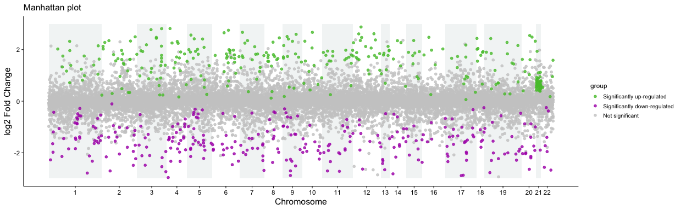<!-- -->


## Chromosome 21 heatmap

Visualize expression of chromosome 21 genes, aggregated within each cell line:


```r
chr21_genes <- res_slfc_annot %>% 
  filter(padj < 0.05) %>% 
  filter(chromosome_name == "21") %>% 
  .$gene

mat_chr21 <- assay(vst_data)[chr21_genes, ] %>% 
  as.data.frame() %>%
  rownames_to_column(var = "gene") %>%
  gather(sample, expression, 2:length(.)) %>%
  inner_join(metadata, by = "sample") %>% 
  group_by(gene, cell_type) %>% 
  summarise(mean_expr = mean(expression)) %>% 
  arrange(mean_expr) %>% 
  spread(cell_type, mean_expr) %>% 
  arrange(ATCC, AG07438, GM2504, GM22168, GM22191, GM22260) %>% 
  as.data.frame %>% 
  tibble::column_to_rownames(var = "gene") %>% 
  t()

mat_chr21 <- mat_chr21[names(pal_cell_type),]

anno_grouped <- data.frame(cell_type = names(pal_cell_type))
rownames(anno_grouped) <- names(pal_cell_type)

pheatmap(mat_chr21,
         color = pal_gm,
         scale = "column",
         cutree_rows = 2,
         border_color = NA,
         annotation_row = anno_grouped,
         annotation_names_row = FALSE,
         annotation_colors = list(cell_type = pal_cell_type),
         cellwidth = 15,
         cellheight = 30,
         filename = "figures/chrm21_hm.pdf")

pheatmap(mat_chr21,
         color = pal_gm,
         scale = "column",
         cutree_rows = 2,
         border_color = NA,
         annotation_row = anno_grouped,
         annotation_names_row = FALSE,
         annotation_colors = list(cell_type = pal_cell_type),
         cellwidth = 15,
         cellheight = 30,
         filename = "figures/chrm21_hm.png")

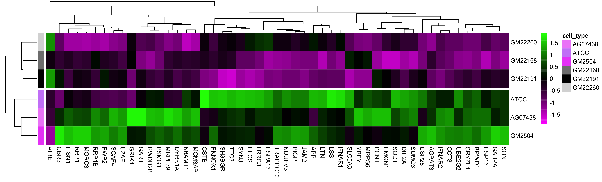
```


## Ideogram

We will also visualize the chromosome 21 genes on an ideogram of the chromosome:


```r
pal_volcano_df <- pal_volcano %>%
  as.data.frame() %>%
  magrittr::set_colnames("Colour") %>%
  tibble::rownames_to_column(var = "Group")

chrm21 <- manhattan_df %>%
  filter(chromosome_name == "21") %>% 
  mutate(Group = case_when(
    (padj < 0.05) & (log2FoldChange > 0) ~ "Significantly up-regulated",
    (padj < 0.05) & (log2FoldChange < 0) ~ "Significantly down-regulated",
    TRUE ~ "Not significant"
  )) %>% 
  left_join(pal_volcano_df, by = "Group") %>% 
  arrange(abs(log2FoldChange)) %>% 
  mutate(cex = sqrt(-log(padj))/4)
  
chrm21_label <- chrm21 %>% filter(gene %in% goi) %>% 
  rowwise() %>% 
  mutate(gene_mean = mean(x = c(start_position, end_position))) %>% 
  ungroup()
```


```r
kp <- plotKaryotype(plot.type = 1, chromosomes = "chr21")

kpAxis(kp, ymin = -2, ymax = 2, r0 = 0, r1 = 1, numticks = 5, cex = 0.9)

kpAddLabels(kp, labels = "log2 FC", srt = 90, pos=1, label.margin = 0.05, ymax = -2, ymin = 2, r1 = 1, cex = 0.8)

kpAddCytobandLabels(kp, cex = 0.6, force.all = TRUE)

kpAbline(kp, chr = "chr21", h = 0.5)

kpPoints(kp,
         chr = "chr21",
         x = chrm21$start_position, y = chrm21$log2FoldChange,
         pch = 16,
         cex = 0.9,
         r0 = 0, r1 = 1, ymin = -2, ymax = 2, col = as.character(chrm21$Colour))

kpPlotMarkers(kp, chr = "chr21", x = chrm21_label$start_position, y = rep(1, nrow(chrm21_label)),
              labels = chrm21_label$gene, cex = 0.8, r0 = 1)

kpSegments(kp, chr = "chr21", x0 = chrm21_label$gene_mean,
           x1 = chrm21_label$gene_mean,
           y0 = chrm21_label$log2FoldChange,
           y1 = 2,
           ymax = 2,
           ymin = -2,
           r1 = 1)
```

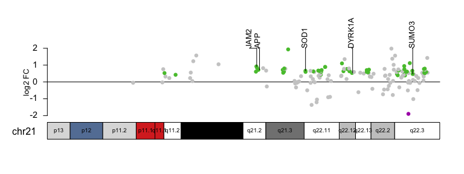<!-- -->

## Heatmap of top 50 differentially expressed genes

Ranking significantly differentially-expressed genes by shrunken fold change, and
visualizing expression levels of these genes in a heatmap:


```r
top50 <- res_slfc_annot %>%
  arrange(desc(abs(log2FoldChange))) %>% 
  filter(padj < 0.05) %>%
  dplyr::slice(1:50) %>%
  .$gene
 
mat_top50 <- assay(vst_data)[top50, ]
  
pheatmap(mat_top50,
         col = pal_gm,
         scale = "row",
         clustering_distance_rows = "euclidean",
         clustering_distance_cols = "euclidean",
         annotation_col = dplyr::select(anno, -sample),
         annotation_names_col = FALSE,
         annotation_colors = list(cell_type = pal_cell_type),
         annotation_legend = TRUE,
         fontsize = 8,
         border_color = NA,
         cutree_rows = 2,
         cluster_cols = FALSE)
```

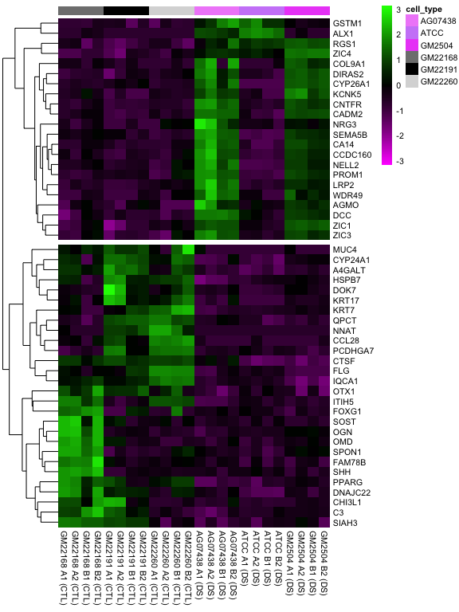<!-- -->


## Volcano plots

Here we visualize differentially expressed genes using volcano plots, where the effect size
(shrunken log fold-changes) is on the x-axis, and the -log10 of the adjusted $p$ value is on the y-axis.

Add some information to the data to aid in plotting:


```r
alpha <- 0.05

res_slfc_annot <- res_slfc_annot %>% 
  mutate(log_padj = -log10(padj),
         significance = ifelse(padj < alpha, "p_adj < 0.05", "p_adj >= 0.05"),
         protocadherin = ifelse(str_detect(gene, "PCDH"), TRUE, FALSE)) %>% 
  dplyr::mutate(group = case_when(
    (padj < 0.05) & (log2FoldChange > 0) ~ "Significantly up-regulated",
    (padj < 0.05) & (log2FoldChange < 0) ~ "Significantly down-regulated",
    TRUE ~ "Not significant"
  )) %>% 
  mutate(direction = ifelse(log2FoldChange > 0, "Up", "Down"))
```

Make the plots:


```r
p1 <- res_slfc_annot %>% 
  arrange(log_padj) %>% 
  ggplot(aes(x = log2FoldChange, y = log_padj)) +
  geom_point(aes(colour = group), alpha = 0.8) +
  scale_colour_manual(values = pal_volcano) +
  theme_pub() +
  xlab("log2(fold change)") +
  ylab("-log10(adjusted p value)")

p1 + 
  geom_text_repel(data = filter(res_slfc_annot, gene %in% goi, padj < 0.05),
                  aes(log2FoldChange, log_padj, label = gene),
                  nudge_x = 0.5, nudge_y = 0.5,
                  size = 3, segment.colour = "gray80")
```

<!-- -->

Volcano plot without labels for figure for creating rasterized figure:


```r
p1 <- res_slfc_annot %>% 
  arrange(log_padj) %>% 
  ggplot(aes(x = log2FoldChange, y = log_padj)) +
  geom_point(aes(colour = group), alpha = 0.8) +
  scale_colour_manual(values = pal_volcano) +
  theme_pub() +
  xlab("log2(fold change)") +
  ylab("-log10(adjusted p value)")

p1
```

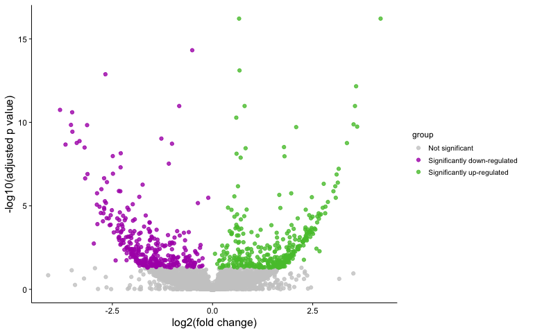<!-- -->
  
# Concordance with qPCR
  
To validate the top hits in our RNA-seq experiment, we also performed qPCR, and here, we quantify the agreement between the two measures. No filtering here for significance.


```r
qpcr <- readxl::read_xlsx("data/qpcr_v2.xlsx")

qpcr_fc_df <- qpcr %>%
  rename(log2fc_pcr = qpcr_log2fc) %>% 
  mutate(significant_in_qpcr = recode(significant,
                                      "yes" = "Significant",
                                      "no"  = "Not significant")) %>%
  left_join(res_slfc_annot, by = "gene")

(cor2 <- cor(dplyr::select(qpcr_fc_df, log2FoldChange, log2fc_pcr), method = "pearson"))
```

```
##                log2FoldChange log2fc_pcr
## log2FoldChange      1.0000000  0.7443878
## log2fc_pcr          0.7443878  1.0000000
```

```r
qpcr_fc_df %>%
  ggplot(aes(x = log2FoldChange, y = log2fc_pcr)) +
  geom_point(aes(colour = significant_in_qpcr)) +
  scale_color_manual(values = c("Significant" = "black",
                               "Not significant" = "gray70")) +
  geom_smooth(method = lm, se = FALSE, colour = pal_extremes[2]) +
  geom_text_repel(aes(label = gene, colour = significant_in_qpcr), size = 3) +
  annotate(geom = "text", x = -1, y = 3, label = paste0("Pearson correlation: ", round(cor2[1, 2], 3))) +
  xlab("RNA-seq log2 Fold Change") + ylab("qRT-PCR log2 Fold Change") +
  ggtitle("Correspondence between qRT-PCR and RNA-seq") +
  theme_pub()
```

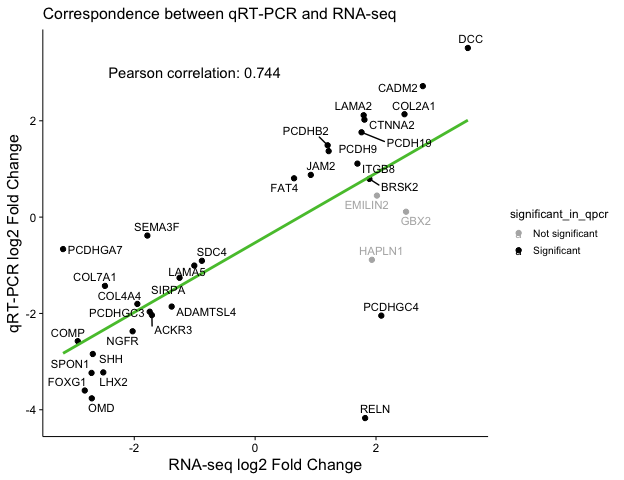<!-- -->


# Gene ontology and pathway analysis

## Via DAVID

We use the following gene lists to run pathway analysis using [DAVID Bioinformatics Resources](https://david.ncifcrf.gov/home.jsp):

- Input list: All significantly differentially expressed genes
- Custom background list: All expressed genes, defined as genes in the upper three quartiles
of expression for at least one sample


```r
# Get expressed genes

baseMeans <- rowMeans(counts(dds, normalized = TRUE))
expression_threshold <- quantile(baseMeans, 0.1)

# The background lists
genes_bg_david <- res_slfc_annot %>% 
  filter(baseMean > expression_threshold) %>% 
  dplyr::select(ensembl_gene_id) %T>% 
  write_tsv("output/DAVID_background_genes.tsv")

genes_for_david <- res_slfc_annot %>% 
  filter(padj < 0.05) %T>%
  {write_tsv(dplyr::select(., ensembl_gene_id), "output/DAVID_de_genes.tsv")}
```

Read in the GO analysis for biological process:


```r
david_bp <- read_tsv("output/david_go_bp.tsv")
david_mf <- read_tsv("output/david_go_mf.tsv")
david_cc <- read_tsv("output/david_go_cc.tsv")

david_out <- bind_rows(david_bp, david_mf, david_cc) %>% 
  separate(Term, into = c("GO_id", "Term_short"), sep = "~") %>% 
  mutate(Term_short = factor(Term_short, levels = unique(.$Term_short))) %>% 
  mutate(Category = recode(Category,
                           "GOTERM_BP_DIRECT" = "Biological Process",
                           "GOTERM_MF_DIRECT" = "Molecular function",
                           "GOTERM_CC_DIRECT" = "Cellular component")) %>% 
  mutate(log10padj = -log10(Benjamini))
```

Visualize the top results in each GO category:


```r
david_out %>% 
  # Bin number of genes annotated with each GO term
  mutate(N_associated_genes = cut(Count,
                                breaks = c(seq(0, 120, by = 10), +Inf),
                                right = FALSE,
                                include.lowest = TRUE,
                                ordered_result = TRUE)) %>%
  group_by(Category) %>% 
  mutate(Number_genes = n()) %>% 
  mutate(Number_genes = paste0("(n = ", Number_genes, ")")) %>% 
  # Get top 5 terms
  top_n(6, wt = log10padj) %>% 
  arrange(-log10padj) %>% 
  ungroup() %>% 
  ggplot(aes(x = Term_short, y = log10padj)) +
  geom_bar(stat = "identity", aes(fill = N_associated_genes), colour = "black") +
  # geom_text(aes(label = Number_genes), vjust = 0, size = 3, hjust = -0.3) +
  scale_fill_brewer(palette = "Greens") +
  facet_wrap(~ Category, scales = "free_y", ncol = 3) +
  ylab("- log10 adjusted p-value") + xlab("GO Term") +
  scale_y_continuous(breaks = seq(1, 10)) +
  coord_flip() +
  theme_pub()
```

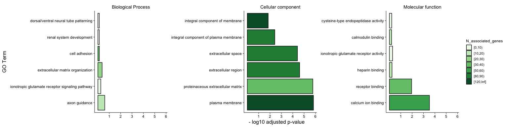<!-- -->

## Via enrichGO


```r
ego <- enrichGO(
  gene = res_slfc_annot %>%
    filter(padj < 0.05) %>%
    pull(gene),
  OrgDb = "org.Hs.eg.db",
  ont = "all",
  keyType = "SYMBOL",
  universe = res_slfc_annot %>%
    filter(baseMean > expression_threshold) %>%
    pull(gene))

# Simplify redundant GO terms quantitatively by assessing their similarity
ego_sim <- bind_rows(
  clusterProfiler:::simplify_internal(ego, measure = "Wang", ontology = "BP") %>% filter(ONTOLOGY == "BP"),
  clusterProfiler:::simplify_internal(ego, measure = "Wang", ontology = "MF") %>% filter(ONTOLOGY == "MF"),
  clusterProfiler:::simplify_internal(ego, measure = "Wang", ontology = "CC") %>% filter(ONTOLOGY == "CC"))

save(ego_sim, file = "output/ego.Rda")
```

Plot the results:


```r
# TODO: change sorting to p-val and color as number of genes
writexl::write_xlsx(ego_sim, "output/RNAseq_enrichGO.xlsx")

ego_top <- ego_sim %>% 
  filter(!is.na(Description)) %>% 
  rename(N_associated_genes = Count) %>%
  mutate(log10padj = -log10(p.adjust)) %>%
  group_by(ONTOLOGY) %>% 
  # Get top 5 terms
  arrange(desc(log10padj)) %>%
  slice(1:5) %>% 
  ungroup()

ego_top %>% 
  arrange(log10padj) %>% 
  mutate(Description = factor(Description, levels = .$Description)) %>% 
  ggplot(aes(x = Description, y = log10padj)) +
  geom_bar(stat = "identity", aes(fill = N_associated_genes), colour = "black", width = 0.5) +
  scale_fill_gradientn(colours = RColorBrewer::brewer.pal(8, "Greens")) +
  facet_wrap(~ ONTOLOGY, scales = "free_y", ncol = 1) +
  ylab("-log10 adjusted p-value") + xlab("GO Term") +
  coord_flip() +
  theme_pub() +
  labs(fill = "Number of associated genes")
```

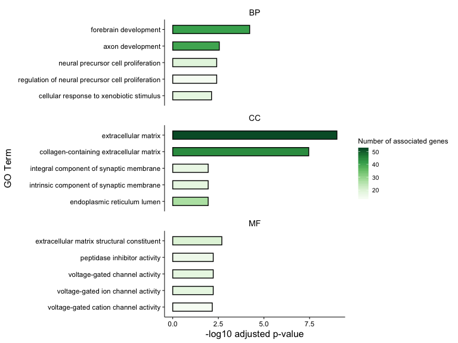<!-- -->
  
## Gene Ontology Analysis using g:Profiler
https://biit.cs.ut.ee/gprofiler

Citation:
Uku Raudvere, Liis Kolberg, Ivan Kuzmin, Tambet Arak, Priit Adler, Hedi Peterson, Jaak Vilo: g:Profiler: a web server for functional enrichment analysis and conversions of gene lists (2019 update) Nucleic Acids Research 2019; doi:10.1093/nar/gkz369. 


```r
gPro <- read_csv("data/gProfiler_hsapiens_11-15-2019_12-19-00 PM__intersections.csv", skip = 17)
```

```
## Parsed with column specification:
## cols(
##   source = col_character(),
##   term_name = col_character(),
##   term_id = col_character(),
##   adjusted_p_value = col_double(),
##   negative_log10_of_adjusted_p_value = col_double(),
##   term_size = col_double(),
##   query_size = col_double(),
##   intersection_size = col_double(),
##   effective_domain_size = col_double(),
##   intersections = col_character()
## )
```

```r
gPro_top <- gPro %>% 
  filter(source == "KEGG" | source == "REAC") %>%
  rename(N_associated_genes = intersection_size) %>%
  group_by(source) %>% 
  arrange(desc(negative_log10_of_adjusted_p_value)) %>%
  slice(1:5) %>% 
  ungroup()

gPro_top %>% 
  arrange(negative_log10_of_adjusted_p_value) %>% 
  mutate(term_name = factor(term_name, levels = .$term_name)) %>% 
  ggplot(aes(x = term_name , y = negative_log10_of_adjusted_p_value)) +
  geom_bar(stat = "identity", aes(fill = N_associated_genes), colour = "black", width = 0.5) +
  scale_fill_gradientn(colours = RColorBrewer::brewer.pal(8, "Greens")) +
  facet_wrap(~ source, scales = "free_y", ncol = 1) +
  ylab("-log10 adjusted p-value") + xlab("GO Term") +
  coord_flip() +
  theme_pub() +
  labs(fill = "Number of associated genes")
```

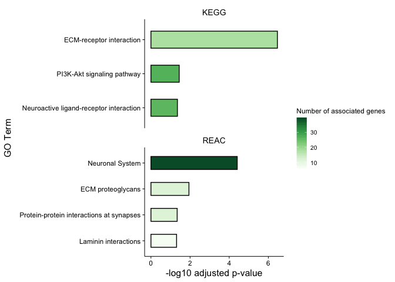<!-- -->
  
# Comaprison to other studies
Here we evaluated the concordance of our differential gene expression with two published studies, [Gonzales, et. al, 2018](https://www.ncbi.nlm.nih.gov/pmc/articles/PMC5870938/) [Huo, et. al, 2018](https://www.ncbi.nlm.nih.gov/pmc/articles/PMC5998838/) that examined changes in gene expression in hIPSC-derived cells from Down Syndrome patients.  


```r
plotATACvsRNA <- function(df, threshold = 2) {
  
  df <- df %>% 
    mutate(relation = case_when((our_LFC > threshold & their_LFC > threshold) |
                                  (our_LFC < -threshold & their_LFC < -threshold) ~ "agreement",
                                (our_LFC > threshold & their_LFC < -threshold) |
                                  (our_LFC < -threshold & their_LFC > threshold) ~ "disagreement",
                                TRUE ~ "none"))
  
  df %>% 
    arrange(relation) %>% 
    ggplot(aes(x = our_LFC, y = their_LFC)) +
    geom_point(alpha = 0.8, aes(colour = relation)) +
    xlim(-4, 4) + ylim(-4, 4) +
    scale_colour_manual(values = c("agreement" = "blue", "none" = "gray80", "disagreement" = "red")) +
    geom_text_repel(data = filter(df, grepl("agreement", relation)),
                    aes(x = our_LFC, y = their_LFC, label = gene),
                    size = 3) +
    theme_pub()
  
}
```

## Gonzales et. al, 2018
Only genes that appreared significant in our study as well were considered.

```r
gonzales <- read_xlsx("data/gonzales_tableS2.xlsx")

gonzales <- gonzales %>% 
  filter(padj < 0.05) %>%
  select(c(`Gene name`, log2FoldChange)) %>%
  rename(their_LFC = log2FoldChange) %>%
  mutate(their_LFC = as.numeric(their_LFC))


PonroyGonz <- res_slfc_annot %>%
  filter(padj < 0.05) %>% 
  select(c(gene, log2FoldChange)) %>%
  rename(our_LFC = log2FoldChange) %>%
  left_join(gonzales, by = c("gene" = "Gene name")) %>% 
  drop_na()
```


```r
PonroyGonz %>% 
  plotATACvsRNA(threshold = 1) +
   ggtitle("Fold change concordance between this study and Gonzales et al.")
```

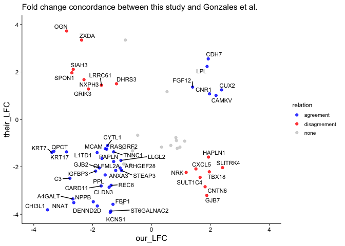<!-- -->

## Hai-Qin Huo et. al, 2018  
Only genes that appreared significant in our study as well were considered.  

```r
huo <- read_xlsx("data/Hai-Qin Huo et al 2018 gaba neurons significant genes.xlsx")

huo <- huo %>% 
  filter(q_value < 0.05) %>%
  select(c(GeneID, `log2(Trisomy/Euploid)`)) %>%
  rename(their_LFC = `log2(Trisomy/Euploid)`) %>%
  mutate(their_LFC = as.numeric(their_LFC))


PonroyHuo <- res_slfc_annot %>%
  filter(padj < 0.05) %>% 
  select(c(gene, log2FoldChange)) %>%
  rename(our_LFC = log2FoldChange) %>%
  left_join(huo, by = c("gene" = "GeneID")) %>% 
  drop_na()
```


```r
PonroyHuo %>% 
  plotATACvsRNA(threshold = 1) +
   ggtitle("Fold change concordance between this study and Huo et al.")
```

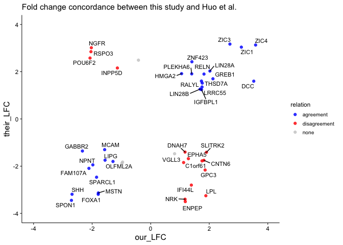<!-- -->

# Session info


```r
sessionInfo()
```

```
## R version 3.6.0 (2019-04-26)
## Platform: x86_64-apple-darwin18.6.0 (64-bit)
## Running under: macOS Mojave 10.14.6
## 
## Matrix products: default
## BLAS/LAPACK: /usr/local/Cellar/openblas/0.3.6_1/lib/libopenblasp-r0.3.6.dylib
## 
## locale:
## [1] en_CA.UTF-8/en_CA.UTF-8/en_CA.UTF-8/C/en_CA.UTF-8/en_CA.UTF-8
## 
## attached base packages:
## [1] parallel  stats4    stats     graphics  grDevices utils     datasets 
## [8] methods   base     
## 
## other attached packages:
##  [1] knitr_1.26                  forcats_0.4.0              
##  [3] stringr_1.4.0               dplyr_0.8.3                
##  [5] purrr_0.3.3                 readr_1.3.1                
##  [7] tidyr_1.0.0                 tibble_2.1.3               
##  [9] tidyverse_1.3.0             karyoploteR_1.10.5         
## [11] regioneR_1.16.5             Rtsne_0.15                 
## [13] pheatmap_1.0.12             biomaRt_2.40.5             
## [15] DESeq2_1.24.0               SummarizedExperiment_1.14.1
## [17] DelayedArray_0.10.0         BiocParallel_1.18.1        
## [19] matrixStats_0.55.0          GenomicRanges_1.36.1       
## [21] GenomeInfoDb_1.20.0         org.Hs.eg.db_3.8.2         
## [23] AnnotationDbi_1.46.1        IRanges_2.18.3             
## [25] S4Vectors_0.22.1            Biobase_2.44.0             
## [27] BiocGenerics_0.30.0         clusterProfiler_3.12.0     
## [29] readxl_1.3.1                magrittr_1.5               
## [31] cowplot_1.0.0               venn_1.8                   
## [33] glue_1.3.1                  ggrepel_0.8.1              
## [35] ggplot2_3.2.1              
## 
## loaded via a namespace (and not attached):
##   [1] tidyselect_0.2.5         RSQLite_2.1.4            htmlwidgets_1.5.1       
##   [4] grid_3.6.0               munsell_0.5.0            withr_2.1.2             
##   [7] colorspace_1.4-1         GOSemSim_2.10.0          highr_0.8               
##  [10] rstudioapi_0.10          DOSE_3.10.2              labeling_0.3            
##  [13] urltools_1.7.3           GenomeInfoDbData_1.2.1   polyclip_1.10-0         
##  [16] bit64_0.9-7              farver_2.0.1             vctrs_0.2.0             
##  [19] generics_0.0.2           xfun_0.11                biovizBase_1.32.0       
##  [22] R6_2.4.1                 graphlayouts_0.5.0       locfit_1.5-9.1          
##  [25] AnnotationFilter_1.8.0   bitops_1.0-6             fgsea_1.10.1            
##  [28] gridGraphics_0.4-1       assertthat_0.2.1         scales_1.1.0            
##  [31] ggraph_2.0.0             nnet_7.3-12              enrichplot_1.4.0        
##  [34] gtable_0.3.0             tidygraph_1.1.2          ensembldb_2.8.1         
##  [37] rlang_0.4.2              zeallot_0.1.0            genefilter_1.66.0       
##  [40] splines_3.6.0            rtracklayer_1.44.4       lazyeval_0.2.2          
##  [43] acepack_1.4.1            dichromat_2.0-0          broom_0.5.2             
##  [46] europepmc_0.3            checkmate_1.9.4          BiocManager_1.30.10     
##  [49] yaml_2.2.0               reshape2_1.4.3           modelr_0.1.5            
##  [52] GenomicFeatures_1.36.4   backports_1.1.5          qvalue_2.16.0           
##  [55] Hmisc_4.3-0              tools_3.6.0              ggplotify_0.0.4         
##  [58] ellipsis_0.3.0           RColorBrewer_1.1-2       ggridges_0.5.1          
##  [61] Rcpp_1.0.3               plyr_1.8.5               base64enc_0.1-3         
##  [64] progress_1.2.2           zlibbioc_1.30.0          RCurl_1.95-4.12         
##  [67] prettyunits_1.0.2        rpart_4.1-15             viridis_0.5.1           
##  [70] haven_2.2.0              cluster_2.1.0            fs_1.3.1                
##  [73] data.table_1.12.8        DO.db_2.9                triebeard_0.3.0         
##  [76] reprex_0.3.0             ProtGenerics_1.16.0      hms_0.5.2               
##  [79] evaluate_0.14            xtable_1.8-4             XML_3.98-1.20           
##  [82] gridExtra_2.3            compiler_3.6.0           writexl_1.2             
##  [85] crayon_1.3.4             htmltools_0.4.0          Formula_1.2-3           
##  [88] geneplotter_1.62.0       lubridate_1.7.4          DBI_1.0.0               
##  [91] tweenr_1.0.1             dbplyr_1.4.2             MASS_7.3-51.4           
##  [94] Matrix_1.2-18            cli_2.0.0                igraph_1.2.4.2          
##  [97] pkgconfig_2.0.3          rvcheck_0.1.7            GenomicAlignments_1.20.1
## [100] foreign_0.8-72           xml2_1.2.2               annotate_1.62.0         
## [103] admisc_0.5               XVector_0.24.0           rvest_0.3.5             
## [106] bezier_1.1.2             VariantAnnotation_1.30.1 digest_0.6.23           
## [109] Biostrings_2.52.0        rmarkdown_1.18           cellranger_1.1.0        
## [112] fastmatch_1.1-0          htmlTable_1.13.3         curl_4.3                
## [115] Rsamtools_2.0.3          lifecycle_0.1.0          nlme_3.1-143            
## [118] jsonlite_1.6             fansi_0.4.0              viridisLite_0.3.0       
## [121] BSgenome_1.52.0          pillar_1.4.2             lattice_0.20-38         
## [124] httr_1.4.1               survival_3.1-8           GO.db_3.8.2             
## [127] UpSetR_1.4.0             png_0.1-7                bamsignals_1.16.0       
## [130] bit_1.1-14               ggforce_0.3.1            stringi_1.4.3           
## [133] blob_1.2.0               latticeExtra_0.6-28      memoise_1.1.0
```

